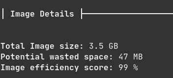

# artis3n/kali

A kalilinux/kali-rolling container with extra juice.

[](https://github.com/artis3n/kali-artis3n/actions)
[](https://github.com/artis3n/kali-artis3n/releases)
[](https://hub.docker.com/r/artis3n/kali)


[](https://github.com/artis3n/)
[](https://twitter.com/Artis3n)

The [kalilinux/kali-rolling](https://www.kali.org/docs/containers/official-kalilinux-docker-images/) container comes with few pre-installed services. It is meant to be lightweight and clocks in around 118 MB. This container is around 2.2 GB. It installs and pre-configures a number of frequently uses Kali tools. It is meant to allow you to get up and running with a Kali environment on an ephemeral host. Don't spend time configuring and tweaking - pull, run, execute, pwn.

A premium is placed on keeping this image as small as is reasonable given its intended purpose. For example, `searchploit` is installed in this image but `searchsploit -u` is not run to install exploitdb-papers because this increases the image size to 7.9 GB - a 6GB increase. Efficiency of the build image is checked with [dive](https://github.com/wagoodman/dive):



<small>Last checked: 2020-03-04</small>

## Usage

Download the image:

- [Docker Hub](https://hub.docker.com/repository/docker/artis3n/kali)
- [GitHub Packages](https://github.com/artis3n/kali-artis3n/packages/143757)

```bash
docker pull artis3n/kali:latest
# or
docker pull docker.pkg.github.com/artis3n/kali-artis3n/kali:latest
```

Run the container:

```bash
docker run --name kali -it --rm artis3n/kali:latest
# Or detach the container and run commands through it
docker run --name kali -id --rm artis3n/kali:latest
docker exec -t kali nmap -p- 127.0.0.1
```


Get a terminal for the backgrounded container:

```bash
docker exec -it kali /bin/bash
```


Remove the backgrounded container:

```bash
docker stop kali
```


## Configured tools

- Metasploit / Meterpreter
  - PostgreSQL 12
- [AutoRecon](https://github.com/Tib3rius/AutoRecon)
  - curl
  - enum4linux
  - gobuster
  - nbtscan
  - nikto
  - nmap
  - onesixtyone
  - oscanner
  - smbclient
  - smbmap
  - smtp-user-enum
  - snmpwalk
  - sslscan
  - svwar
  - tnscmd10g
  - whatweb
  - wkhtmltoimage
- Proxychains4 ([proxychains-ng](https://github.com/rofl0r/proxychains-ng))
- Searchsploit ([ExploitDB](https://www.exploit-db.com/searchsploit))
- JohnTheRipper (jumbo)
- SQLMap

## Contributions

Missing a tool you would like pre-configured? File a ticket and I will add it. A pull request is also welcome.

For any new tools, you must add validation tests to `.github/workflows/ci.yml`. Use the existing tests as a baseline. These tests ensure the tools are installed and pre-configured correctly.
